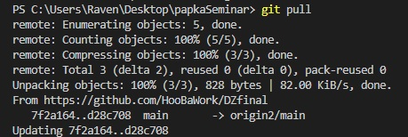

# Конспект по командам git.

## Команда init.

Команда init необходимиа для иницилизации файла в репозитории.

## Команда add.

Добавляет изменения в текущую ветку файла.

## Команда commit.

Команда -m commit позволяет добавлять комментарии к изменениям .

## Команда remote add.

Команда  remote add позволяет связывать свой локальный репозиторий с удаленным .

## Команда branch -M main.
Команда  branch -M main позволяет сделать ветку main в удалённом репозитории основной.

## Команда pull.
Команда pull позволяет обновить локальный репозиторий до состояния удалённого.

## Команда clone.
Команда clone позволяет клонировать форкнутый в свой удалённый репозиторий для работы с ним.
